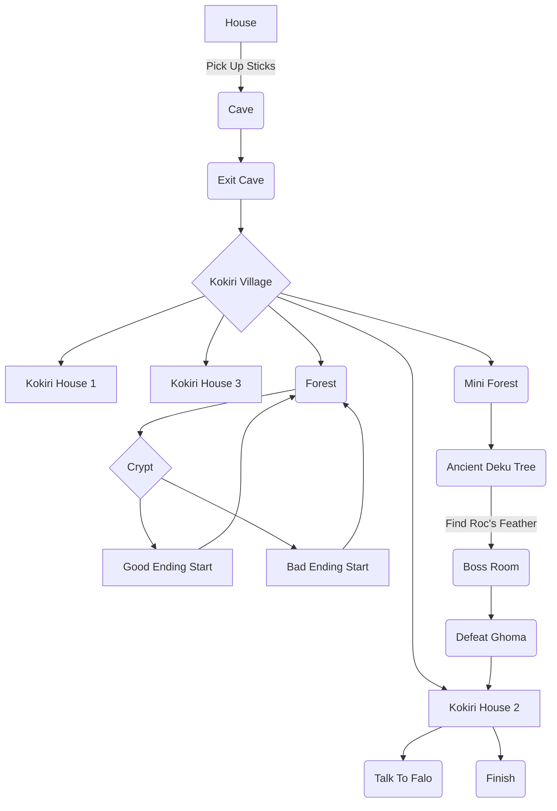

# Checklist

Code the text based adventure •

2-3 endings •

background music •

battle music •

## game specific:

Explain the background for oot and mm X (Assume knowledge)

explain why link is where he is •

the story will be based off the indigo romhack •

## timeline

Exit house •

Pick up sticks •

Enter cave •

Exit cave •

Enter kokiri house 2 (3 houses total including shop) •

Talk to Falo •

Exit kokiri house 2 •

enter forest •

enter crypt •

option 1: kill the kokiri warrior and take the sword (bad ending start) •

option 2: spare the kokiri warrior and take the sword (good ending start) •

exit crypt •

exit forest •

enter mini forest •

enter ancient deku tree •

find roc's feather •

defeat ancient ghoma •

exit the ancient deku tree •

exit mini forest •

enter kokiri house 2 •

talk to Falo •

obtain forest's blessing X (Information makes more sense)

Fini •

## Bad Ending

talk to Falo • 

Unable To Obtain Forest's blessing X (Refusal of information makes more sense)

Lose *

# Flowchart

